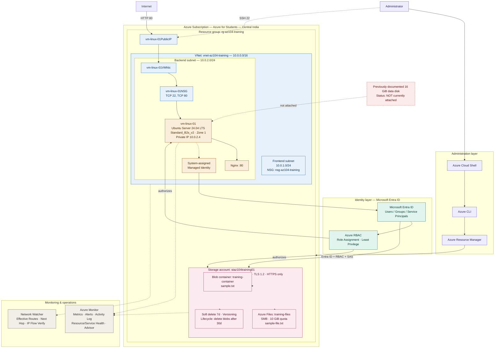

# Azure CLI Infrastructure Project — Complete Day 01–Day 10 Architecture

A single, unified architecture for an AZ-104-aligned Azure Administrator portfolio project, built entirely with Azure CLI and Azure Cloud Shell.

## Architecture diagram

> Rendered natively by GitHub when this file is viewed as a README. Dashed lines represent SSH, the RBAC-mediated identity path to Entra ID, monitoring hooks, and the disconnected legacy disk. Solid lines represent live data/network paths.

## B. Architecture description

This is one end-to-end Azure Administrator environment, not ten separate diagrams. Everything sits inside a single subscription (**Azure for Students**, **Central India**) and a single resource group, **rg-az104-training**. An administrator drives every change through **Azure Cloud Shell → Azure CLI → Azure Resource Manager** — there is no portal-driven configuration represented here, since ARM is the only control plane touching the resource group. Inside the resource group, a virtual network hosts one Ubuntu VM running Nginx, a storage account holds both Blob and Azure Files, and identity/RBAC threads through Microsoft Entra ID to authorize both compute and storage access. Azure Monitor and Network Watcher sit alongside as the operations and diagnostics layer, observing the environment without being part of the deployed data path.

## C. Component explanation

- **Administration layer** — Cloud Shell and Azure CLI are the operator interface; ARM is the control-plane API every CLI command ultimately calls.
- **Identity layer** — Microsoft Entra ID holds users, groups, and service principals/managed identities; Azure RBAC issues scoped role assignments against specific resources under least privilege.
- **Networking** — `vnet-az104-training` (10.0.0.0/16) splits into a Frontend subnet (10.0.1.0/24, governed by `nsg-az104-training`) and a Backend subnet (10.0.2.0/24) that actually holds the VM's NIC. The VM's effective NSG is its own `vm-linux-01NSG` (SSH 22, HTTP 80) — not the subnet-level NSG.
- **VM** — `vm-linux-01`, Ubuntu Server 24.04 LTS, Standard_B2s_v2, Zone 1, private IP 10.0.2.4, exposed via `vm-linux-01PublicIP`.
- **Linux administration** — SSH, APT, systemd, Nginx, networking, filesystem, and disk management all live as capabilities inside the VM guest OS, not as separate Azure resources.
- **Nginx** — the web server process serving HTTP on port 80.
- **Storage** — `staz104training01` (StorageV2, Standard_LRS, Hot, HTTPS-only, TLS 1.2, public blob access disabled) hosts a blob container (`training-container/sample.txt`) and an Azure Files SMB share (`training-files/sample-file.txt`, 10 GiB quota), with soft delete (7 days), versioning, and a 30-day lifecycle deletion policy on block blobs.
- **Identity/RBAC** — Entra ID authenticates; RBAC authorizes scoped access to the VM, storage account, blob container, and file share.
- **Managed identity** — a system-assigned identity on `vm-linux-01` lets the VM authenticate to Entra ID and be authorized by RBAC without stored credentials.
- **Monitoring** — Azure Monitor covers metrics, metric alerts, activity log, resource/service health, Advisor, and guest-level monitoring; no Log Analytics workspace exists in this build.
- **Network Watcher** — used externally to troubleshoot the VM's network path (effective routes, next hop, IP flow verify); it is not a resource deployed inside the VNet.
- **Troubleshooting** — a cross-cutting layer spanning CLI, Monitor, Network Watcher, activity log, resource/service health, Linux diagnostics, Nginx logs, NSG inspection, and RBAC verification.
- **Legacy data disk** — a 16 GiB disk once documented at `/data` was confirmed during Day 09 verification (`df -h`, `findmnt`, `lsblk -f`, `storageProfile.dataDisks`) to be currently unattached, and is shown outside the active path.

## D. Day 01–Day 10 mapping

| Day | Focus |
|---|---|
| 01 | Azure CLI + resource groups |
| 02 | VNet + subnets + NSGs |
| 03 | VM + managed disks |
| 04 | Ubuntu Linux + Nginx + SSH |
| 05 | Entra ID + RBAC + managed identity |
| 06 | Storage account + blob storage + SAS |
| 07 | Azure Files + storage protection |
| 08 | Advanced networking + Network Watcher |
| 09 | Azure Monitor + operational troubleshooting |
| 10 | Identity/RBAC administration + troubleshooting |

## E. Data flow

- **HTTP** — Internet → `vm-linux-01PublicIP` → `vm-linux-01VMNic` → `vm-linux-01NSG` → `vm-linux-01` → Nginx :80
- **SSH** — Administrator → SSH :22 → `vm-linux-01PublicIP` → `vm-linux-01NSG` → `vm-linux-01`
- **Blob access** — Microsoft Entra ID → Azure RBAC → `staz104training01` → `training-container` → `sample.txt`
- **Managed identity** — `vm-linux-01` → system-assigned managed identity → Microsoft Entra ID → Azure RBAC → target Azure resource
- **Monitoring** — VM and storage account → Azure Monitor
- **Network diagnostics** — VNet/NIC/VM → Network Watcher

## F. Security model

NSGs enforce network-layer access: only SSH (22) and HTTP (80) are open on `vm-linux-01NSG`, which is the VM's actual effective NSG (distinct from the frontend subnet's `nsg-az104-training`). Identity and authorization are separated — Entra ID authenticates a principal, RBAC then authorizes that principal against a specific resource scope under least privilege, rather than granting blanket access. The VM's system-assigned managed identity extends this model to workload access, letting the VM reach authorized resources without embedded credentials. Storage-layer security stacks HTTPS-only transport, TLS 1.2 minimum, disabled public blob access, and RBAC/Entra-ID-gated or user-delegation-SAS-gated data access, plus soft delete, versioning, and lifecycle management as data-protection controls rather than access controls.

## G. AZ-104 skills demonstrated

- Managing Azure identities and governance (Entra ID, RBAC, managed identity)
- Implementing and managing storage (StorageV2, Blob, Azure Files, protection policies)
- Deploying and managing Azure compute resources (VM sizing, availability zones, Linux administration)
- Configuring and managing virtual networking (VNet, subnets, NSGs, effective security rules)
- Monitoring and backing up Azure resources (Azure Monitor, Network Watcher, activity/resource/service health)
- Azure CLI / Cloud Shell as the operational administration interface, mapped to ARM as the control plane
